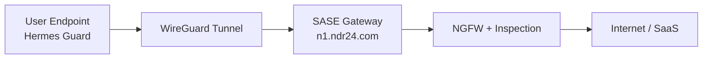
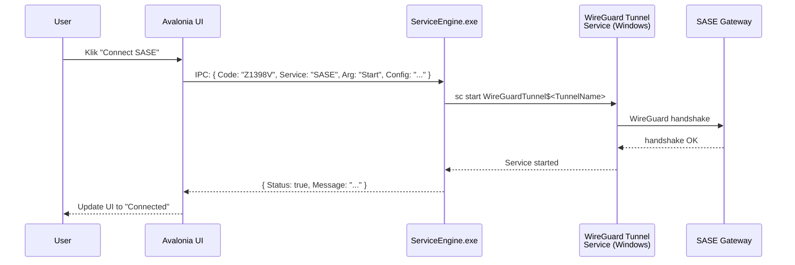

# 1. Pendahuluan
{: .no_toc }

## Daftar Isi
{: .no_toc .text-delta }

1. TOC
{:toc}

---

## 1.1 Konteks: SASE di Hermes Network 360 Guard

**Hermes Network 360 Guard** adalah aplikasi desktop cross-platform (Windows + macOS) berbasis Avalonia (.NET 8). Salah satu komponen utamanya adalah **SASE** — *Secure Access Service Edge* — yang memberikan tunnel terenkripsi dari endpoint user ke gateway perusahaan, sehingga semua trafik yang ditarget (atau seluruh trafik, tergantung policy) lewat sana dengan inspeksi NGFW dan policy enforcement terpusat.

Implementasi SASE di Hermes saat ini menggunakan **WireGuard** sebagai data plane:

- Lightweight (~4000 LoC kernel module)
- Sangat cepat (kernel-mode di Win/Linux, NetworkExtension di Mac)
- Crypto modern (Curve25519, ChaCha20-Poly1305, BLAKE2s)
- Sederhana (config = INI file, `[Interface]` + `[Peer]` blocks)
- Stateless di kernel (data plane), kontrol via userspace tools

Gateway SASE Hermes dideploy di `n1.ndr24.com` (terlihat di log `app.log`).

## 1.2 Apa itu SASE?

SASE adalah pola arsitektur jaringan yang menggabungkan:

- **SD-WAN / VPN client** (data plane) → WireGuard di kasus kami
- **Secure Web Gateway** (URL filtering, malware scan)
- **CASB** (Cloud Access Security Broker)
- **Zero Trust Network Access (ZTNA)** (identity-aware access)
- **NGFW** (Next-Gen Firewall)

Untuk Hermes, scope SASE yang kita refactor di dokumen ini adalah **data plane (WireGuard) + control plane (config + policy)**. NGFW dan content inspection ada di gateway, tidak di-touch.



## 1.3 Implementasi saat ini

Berdasarkan audit kode (`HermesNetwork/Service/IpcComService.cs`, `ConfigViewModel.cs`, dan log produksi) dan log aplikasi:

```
07/11/2025 11:08:17.298 AM ConfigViewModel.cs ExecuteSaseButton:1555 -
  'Button SASE Clicked...isSaseUseWireGuard : True...isSaseConfigurationReady : True'
07/11/2025 11:08:15.550 AM ConfigViewModel.cs GetStateSase:390 -
  'SASE state: [SC] EnumQueryServicesStatus:OpenService FAILED 1060'
```

Komponen yang ada:

1. **WireGuard tunnel service** — Windows service yang dikelola oleh `wireguard.exe` (`/installtunnelservice`)
2. **Custom IPC** — UI Avalonia → `ServiceEngine.exe` lewat named-pipe / TCP localhost dengan JSON ad-hoc
3. **`ConfigViewModel`** — handle button SASE, query state via `sc.exe` (Windows Service Manager)
4. **Konfigurasi statis** — `.conf` file di-generate saat install dari payload yang di-encode base64

Aliran tipikal "user klik tombol Connect SASE":



## 1.4 Masalah dengan implementasi saat ini

### 1.4.1 Konfigurasi statis, sulit di-rotate

Config `.conf` WireGuard di-generate saat install dengan key + peer detail di-hardcode. Untuk:

- Rotate kunci: generate ulang, push ke setiap client manual, restart tunnel
- Ganti gateway IP: redeploy installer
- Ubah AllowedIPs: redeploy installer

Tidak ada cara user/admin untuk **refresh config dari backend** saat aplikasi jalan.

### 1.4.2 Tidak ada identity-aware policy

Semua user di organisasi yang sama dapat config WireGuard yang **identik**. Implikasinya:

- Tidak bisa beda-beda AllowedIPs per role (HR vs Engineer)
- Tidak bisa revoke akses individu tanpa rotate key untuk semua orang
- Audit log "siapa yang masuk ke server X" sulit dibangun karena semua peer pakai source IP yang sama
- Compromised laptop = compromise akses semua orang sampai key di-rotate global

### 1.4.3 Custom IPC yang sama dengan TRMM

Sama seperti masalah di TRMM (lihat [Panduan TRMM](https://ardika.github.io/hermes-trmm-docs/)):

- Magic strings (`Code: "Z1398V"`)
- Tidak versioned
- Tidak schema-validated
- Sulit di-test

### 1.4.4 Tidak ada PSK (Pre-Shared Key)

Config WireGuard standar Hermes tidak pakai PSK. Tanpa PSK, kalau private key bocor ke attacker, attacker bisa langsung masuk ke gateway. Dengan PSK, attacker butuh **dua** secret (private key + PSK) untuk berhasil handshake.

WireGuard mendukung PSK out-of-the-box; ini jelas tertinggal.

### 1.4.5 Reconnection / roaming brittle

WireGuard self-heal kalau IP user berubah (laptop pindah dari WiFi ke 4G), tapi:

- Kalau **endpoint gateway** berubah (failover ke backup gateway), client harus dapat config baru
- Kalau koneksi drop > 3 menit, beberapa state-aware NAT membuang flow → user harus manual disconnect/connect
- Aplikasi tidak punya health check yang aktif memeriksa "tunnel up tapi tidak ada handshake terbaru"

### 1.4.6 DNS leak risk

Default config WireGuard di Windows tidak otomatis set DNS resolver dalam tunnel; user perlu specify `DNS = ...` di interface block. Kalau tidak, request DNS bocor ke ISP user.

### 1.4.7 Split-tunnel hardcoded

Allow IPs yang menentukan trafik mana yang lewat tunnel di-set saat install. Mau ubah dari full-tunnel ke split-tunnel (atau sebaliknya)? Generate ulang installer.

### 1.4.8 Tidak ada audit/observability

Tidak ada laporan ke backend tentang:

- Kapan user connect / disconnect
- Berapa lama tunnel up
- Berapa byte transfer
- Apakah ada handshake failures
- IP publik client saat connect (untuk audit kalau ada incident)

## 1.5 Target setelah refactor

Setelah refactor sesuai dokumen ini, Anda akan punya:

| Aspek | Sebelum | Sesudah |
|-------|---------|---------|
| Config delivery | Hardcoded di installer | Dari Edge Function, per-device, expire 24 jam |
| Identity-aware | Semua user sama | AllowedIPs + DNS per role |
| Key rotation | Manual, redeploy | Automated, transparent ke user |
| PSK | Tidak ada | Auto-generated per peer |
| Roaming detection | Tidak ada | Active health check + reconnect |
| Split-tunnel | Statis | Dinamis dari role policy |
| Audit log | Tidak ada | Full di Supabase + SASE control plane |
| Custom IPC | Required | Hilang — pakai stdlib + HTTPS |

## 1.6 Apa yang BUKAN cakupan

- Setup awal SASE gateway (sudah ada di `n1.ndr24.com`)
- Konfigurasi NGFW / packet inspection di gateway
- Migrasi dari WireGuard ke teknologi lain (mis. OpenZiti, NetBird, Tailscale) — kita **tetap pakai WireGuard**, hanya tambah control plane di atasnya
- Throughput tuning kernel WireGuard
- UI/UX redesign Avalonia

## 1.7 Tujuan dokumen

Setelah membaca dan menerapkan dokumen ini, Anda akan:

1. Memahami **arsitektur tiga-lapis** untuk SASE: TunnelSupervisor + ConfigClient + ConnectionService
2. Bisa mengimplementasikan **`ITunnelSupervisor`** (Windows + macOS) untuk lifecycle WireGuard tunnel
3. Bisa mengimplementasikan **`SaseConfigClient`** + Edge Function untuk per-device config provisioning
4. Memahami strategi **key rotation, PSK, dan identity-aware AllowedIPs**
5. Tahu cara **migrasi inkremental** dari implementasi sekarang ke arsitektur baru
6. Bisa **debug masalah WireGuard umum** (tidak handshake, DNS leak, MTU, dll.)

---

[← Beranda]({{ site.baseurl }}){: .btn }
[Bab 2 — Arsitektur →]({{ site.baseurl }}){: .btn .btn-primary }
