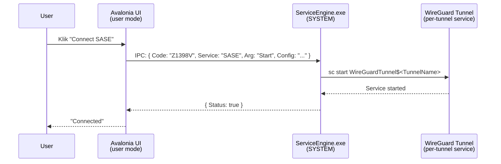

# 1. Pendahuluan
{: .no_toc }

## Daftar Isi
{: .no_toc .text-delta }

1. TOC
{:toc}

---

## 1.1 Konteks: SASE di Hermes Network 360 Guard

**Hermes Network 360 Guard** adalah aplikasi desktop cross-platform (Windows + macOS) berbasis Avalonia (.NET 8). Salah satu komponen utamanya adalah **SASE** — *Secure Access Service Edge* — yang memberikan tunnel terenkripsi dari endpoint user ke gateway perusahaan.

Implementasi SASE di Hermes saat ini menggunakan **WireGuard** sebagai data plane. **Konfigurasi WireGuard per-user** disimpan di Supabase di tabel `user_data` — saat user login, aplikasi membaca konfigurasinya dan apply ke tunnel di endpoint.

> **Penting (terkait konteks deployment):**
> - **Supabase yang dipakai adalah self-hosted**, sehingga fitur **Supabase Edge Functions tidak tersedia**. Komunikasi backend dilakukan langsung ke Postgres via PostgREST (RLS-protected) atau lewat REST service terpisah jika dibutuhkan logic server-side.
> - **`HermesNetwork360Guard.exe` jalan sebagai user biasa, bukan as administrator.** Operasi privileged (install tunnel service, write config, start/stop tunnel) **harus dilakukan oleh komponen helper terpisah** yang punya privilege SYSTEM (Windows) atau root (macOS).
> - **Tidak ada gateway SASE terpusat dengan IP/hostname tunggal.** Tiap user punya konfigurasi WireGuard sendiri — endpoint, peer pubkey, AllowedIPs, dan PrivateKey — tersimpan di kolom `user_data.configuration` (text, full WireGuard INI string) di Supabase production.
> - **Schema Supabase TIDAK boleh diubah** dalam scope implementasi ini. Tidak ada migration, tidak ada `ALTER TABLE`, tidak ada kolom baru. Implementasi harus pakai kolom yang sudah ada.

## 1.2 Apa itu SASE?

SASE adalah pola arsitektur jaringan yang menggabungkan VPN client + secure web gateway + ZTNA + NGFW di satu service edge. Untuk Hermes, scope yang kita refactor di dokumen ini adalah:

- **Data plane**: WireGuard (kernel-mode di Win, NetworkExtension/wireguard-go di Mac)
- **Config plane**: Supabase `user_data` table sebagai source of truth per-user config
- **Local control plane**: Hermes Helper Service untuk eksekusi operasi privileged

Yang **bukan** scope:
- Provisioning gateway / register peer di gateway (di-handle terpisah oleh ops/admin yang populate `user_data`)
- NGFW dan content inspection di gateway

## 1.3 Implementasi saat ini

Berdasarkan audit kode (`HermesNetwork/Service/IpcComService.cs`, `ConfigViewModel.cs`, log produksi):

```
07/11/2025 11:08:17.298 AM ConfigViewModel.cs ExecuteSaseButton:1555 -
  'Button SASE Clicked...isSaseUseWireGuard : True...isSaseConfigurationReady : True'
07/11/2025 11:08:15.550 AM ConfigViewModel.cs GetStateSase:390 -
  'SASE state: [SC] EnumQueryServicesStatus:OpenService FAILED 1060'
```

Komponen yang ada:

1. **WireGuard tunnel service** — Windows service `WireGuardTunnel$<name>` yang di-host oleh binary Hermes sendiri (lewat embedded `tunnel.dll` P/Invoke; bukan `wireguard.exe` external)
2. **`ServiceEngine.exe`** — Windows Service custom (jalan as SYSTEM) yang manage operasi privileged seperti install/start/stop WireGuard
3. **Custom IPC** — UI Avalonia → ServiceEngine via named-pipe JSON ad-hoc dengan magic strings (`Code: "Z1398V"`, dst.)
4. **`ConfigViewModel`** — handle button SASE, query state via `sc.exe`
5. **Konfigurasi statis** — di-install dari payload yang sudah di-encode

Aliran tipikal "user klik tombol Connect SASE":



## 1.4 Masalah pada implementasi saat ini

### 1.4.1 Custom IPC tanpa kontrak

UI berkomunikasi dengan ServiceEngine lewat named-pipe JSON dengan magic strings (`Code: "DL2KNT"`, `Code: "Z1398V"`, dst.):

- Tidak versioned, tidak schema-validated, tidak self-documenting
- Susah test (perlu running ServiceEngine.exe)
- Bug typo di `Config` baru ketahuan saat agent crash

> Catatan: di refactor TRMM (lihat [panduan TRMM](https://ardika.github.io/hermes-trmm-docs/)), kita hilangkan ServiceEngine.exe karena operasinya bisa lewat REST API. Untuk SASE, **kita tetap perlu komponen privileged** karena UI tidak run as admin dan WireGuard butuh privilege untuk install/start service. Solusinya: ganti ServiceEngine yang opaque dengan **Hermes Helper Service** dengan kontrak typed dan scope minimal.

### 1.4.2 UI tidak run as admin

`HermesNetwork360Guard.exe` distribute ke end-user dan jalan dalam konteks user biasa. Operasi WireGuard yang butuh admin:

| Operasi | Butuh admin? |
|---|---|
| Register Windows Service `WireGuardTunnel$<name>` (via `Service.Add()` → `Win32.OpenSCManager` + `CreateService`, embedded di `TunnelDll/`) | ✅ Ya (install service baru) |
| Write config ke `C:\Program Files\WireGuard\Data\Configurations\` | ✅ Ya |
| `sc start WireGuardTunnel$Hermes` | ✅ Ya (dengan SCM access) |
| `wg show` (read status) | ❌ Tidak (di Mac); ya sebagian (di Win, butuh akses pipe) |
| Apply config baru (replace file + restart service) | ✅ Ya |

Kalau kita force UAC dialog tiap kali user klik Connect/Disconnect, UX akan sangat buruk. Solusi: **Hermes Helper Service** yang sekali install (oleh installer dengan elevation), terus jalan sebagai SYSTEM/root, dan UI request operasi via IPC.

### 1.4.3 State drift

State agent (online/offline) di-track di UI dan service tanpa single source of truth — bisa drift.

### 1.4.4 Tidak ada PSK (Pre-Shared Key)

Config WireGuard production saat ini tidak pakai PSK (verified dari sample 5 user real: `PresharedKey` tidak ada). Tanpa PSK, kalau private key bocor, attacker langsung bisa handshake. PSK akan menambah defense-in-depth tapi keputusan tambah PSK adalah keputusan ops + admin tooling, bukan client.

Implementasi client passthrough INI apa adanya — kalau ke depan admin tambah `PresharedKey = ...` di `[Peer]` block, tidak perlu code change.

### 1.4.5 Reconnection / roaming brittle

Tidak ada health check aktif yang detect "tunnel up tapi handshake lama" → user harus manual disconnect/connect.

### 1.4.6 DNS leak risk

Default config tidak otomatis push DNS resolver dalam tunnel; request DNS bocor ke ISP user.

### 1.4.7 Tidak ada audit/observability

Tidak ada laporan ke Supabase tentang connect time, last handshake, byte transfer, errors — sulit untuk audit dan debug.

## 1.5 Target setelah refactor

| Aspek | Sebelum | Sesudah |
|---|---|---|
| Helper service | `ServiceEngine.exe` opaque, JSON ad-hoc | `HermesHelperSvc` typed JSON-RPC, scope minimal |
| Config delivery | Hardcoded saat install | Read dari Supabase `user_data` saat login + on-demand refresh |
| Privileged ops | Disebar di multiple kode IPC | Hanya di Helper Service, well-defined verbs |
| Roaming detection | Tidak ada | Active health check + reconnect |
| PSK | Tidak ada di production | (TIDAK diubah dalam scope ini — keputusan ops kalau mau tambah PSK di admin tooling) |
| Audit log | Tidak ada | Connect events di app log lokal + (opsional) Hermes `LogReportService` existing |
| State source of truth | Local (drift) | `user_data.configuration` (Supabase) + helper status query |

## 1.6 Apa yang BUKAN cakupan

- Setup awal gateway WireGuard (server-side WireGuard) — di-manage ops/admin
- Provisioning per-user WG config di `user_data.configuration` (di-populate via tooling admin di luar app)
- **Perubahan schema Supabase** — schema dilarang diubah dalam scope ini
- NGFW / packet inspection di gateway
- Migrasi ke teknologi VPN lain (kita **tetap pakai WireGuard**)
- UI/UX redesign Avalonia

## 1.7 Tujuan dokumen

Setelah membaca dan menerapkan dokumen ini, Anda akan:

1. Memahami **arsitektur tiga-lapis baru**: UI + HelperService + Supabase
2. Bisa mengimplementasikan **Hermes Helper Service** dengan typed JSON-RPC contract (Win + Mac)
3. Bisa mengimplementasikan **`SaseConfigClient`** yang query `user_data` Supabase langsung (tanpa Edge Function)
4. Bisa mengimplementasikan **`SaseConnectionService`** yang orkestrasi UI ↔ Helper
5. Memahami strategi **migrasi inkremental** dari ServiceEngine yang ada sekarang
6. Tahu cara **debug masalah WireGuard** umum

---

[← Beranda]({{ site.baseurl }}){: .btn }
[Bab 2 — Arsitektur →]({{ site.baseurl }}){: .btn .btn-primary }
