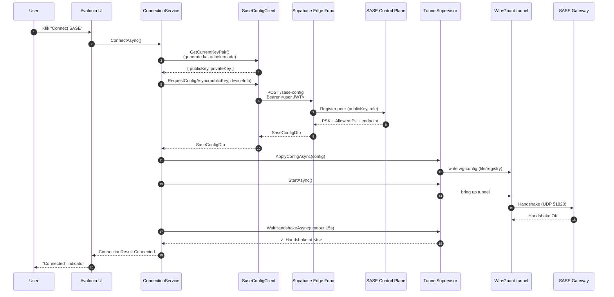
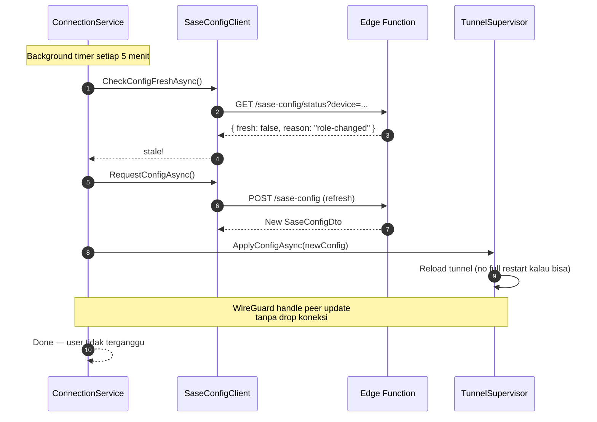

# 2. Arsitektur
{: .no_toc }

## Daftar Isi
{: .no_toc .text-delta }

1. TOC
{:toc}

---

## 2.1 Arsitektur saat ini

```mermaid
flowchart TB
    UI[Avalonia UI<br/>HermesNetwork360Guard.exe]
    SE[ServiceEngine.exe]
    WGS[WireGuard Tunnel Service<br/>WireGuardTunnel$Hermes]
    CONF[wg0.conf<br/>STATIS, di-install sekali]
    GW[SASE Gateway<br/>n1.ndr24.com:51820]

    UI -.JSON IPC.->|Code:Z1398V| SE
    SE -->|sc start| WGS
    WGS -->|baca| CONF
    WGS <-->|UDP 51820| GW

    style UI fill:#3b82f6,stroke:#fff,color:#fff
    style SE fill:#dc2626,stroke:#fff,color:#fff
    style CONF fill:#dc2626,stroke:#fff,color:#fff
    style GW fill:#10b981,stroke:#fff,color:#fff
```

**Karakteristik:**
- Config statis sekali di-install
- Tidak ada feedback dari gateway ke client app
- UI hanya tahu "service running atau tidak", tidak tahu detail (last handshake, peer status)
- Lifecycle dikelola lewat custom IPC yang opaque

## 2.2 Arsitektur baru (target)

```mermaid
flowchart TB
    UI[Avalonia UI<br/>HermesNetwork360Guard.exe]

    subgraph "Layer 1: Local Tunnel Lifecycle"
        TS[ITunnelSupervisor]
        WTS[WindowsTunnelSupervisor]
        MTS[MacTunnelSupervisor]
        TS --> WTS
        TS --> MTS
    end

    subgraph "Layer 2: Config Provisioning"
        SCC[SaseConfigClient]
        EF[Supabase Edge Function<br/>sase-config]
        SCC --> EF
    end

    subgraph "Layer 3: Connection Orchestration"
        CS[ConnectionService]
    end

    subgraph "Local OS"
        WGS_W[wireguard.exe<br/>+ Tunnel Service]
        WGS_M[wg-quick<br/>+ LaunchDaemon]
    end

    SCP[SASE Control Plane<br/>peer registration]
    GW[SASE Gateway<br/>n1.ndr24.com]

    UI --> CS
    CS --> TS
    CS --> SCC

    EF -->|HTTPS API key| SCP
    SCP -->|push peer| GW

    WTS -.named pipe / sc.exe.-> WGS_W
    MTS -.wg-quick / launchctl.-> WGS_M

    WGS_W <-->|UDP encrypted| GW
    WGS_M <-->|UDP encrypted| GW

    style UI fill:#3b82f6,stroke:#fff,color:#fff
    style TS fill:#8b5cf6,stroke:#fff,color:#fff
    style SCC fill:#8b5cf6,stroke:#fff,color:#fff
    style EF fill:#8b5cf6,stroke:#fff,color:#fff
    style CS fill:#8b5cf6,stroke:#fff,color:#fff
    style GW fill:#10b981,stroke:#fff,color:#fff
```

**Karakteristik:**
- **Tiga lapis independen** — bisa di-test terpisah, bisa di-mock
- **Config dinamis** — Edge Function generate per-device, per-session
- **WireGuard tetap data plane** — tidak diganti, hanya dikontrol lebih bersih
- **Tidak ada custom IPC** — pakai stdlib (`ServiceController`, `wg-quick`, named-pipe WireGuard yang resmi)
- **Backend gateway = source of truth** untuk peer state

## 2.3 Tiga lapis: tanggung jawab

### Layer 1 — `ITunnelSupervisor`

**Tanggung jawab:** Lifecycle WireGuard tunnel di OS endpoint.

| Yang dilakukan | Yang TIDAK dilakukan |
|---|---|
| Install / Uninstall tunnel service | Generate config (itu Layer 2) |
| Start / Stop tunnel | Tahu detail SASE backend |
| Apply config baru ke tunnel | Manage user identity |
| Query status (up/down, last handshake, bytes) | Logging server-side |

**Lokasi rekomendasi di repo:**
```
HermesNetwork/
└── Sase/
    └── Supervisor/
        ├── ITunnelSupervisor.cs
        ├── TunnelStatus.cs
        ├── Windows/
        │   └── WindowsTunnelSupervisor.cs
        └── Mac/
            └── MacTunnelSupervisor.cs
```

Detail di [Bab 4 — TunnelSupervisor]({{ site.baseurl }}).

### Layer 2 — `SaseConfigClient`

**Tanggung jawab:** Komunikasi dengan backend untuk dapat config WireGuard yang valid.

| Yang dilakukan | Yang TIDAK dilakukan |
|---|---|
| Generate keypair di client | Memegang gateway secret |
| Kirim public key + device info ke Edge Function | Mengelola peer di gateway langsung |
| Terima config (interface + peer block) | Apply config ke tunnel (itu Layer 1) |
| Refresh config saat expire / role berubah | Authentication user (itu Supabase) |

**Lokasi rekomendasi:**
```
HermesNetwork/
└── Sase/
    └── Config/
        ├── SaseConfigClient.cs
        ├── ISaseConfigClient.cs
        ├── Models/
        │   ├── SaseConfigDto.cs
        │   ├── PeerDto.cs
        │   └── ConfigRequestDto.cs
        └── KeyPairGenerator.cs
```

Detail di [Bab 5 — Config Service]({{ site.baseurl }}).

### Layer 3 — `ConnectionService`

**Tanggung jawab:** Orkestrasi connect / disconnect / reconnect / health check.

```
HermesNetwork/
└── Sase/
    └── ConnectionService.cs       ← orkestrator utama
```

Logika tipikal `ConnectAsync()`:
1. `SaseConfigClient.RequestConfigAsync()` → dapat config terbaru
2. `TunnelSupervisor.ApplyConfigAsync(config)` → tulis config ke OS
3. `TunnelSupervisor.StartAsync()` → bring up tunnel
4. Polling `TunnelSupervisor.GetStatusAsync()` sampai handshake sukses
5. Spawn background task untuk health monitoring

Detail di [Bab 6 — Connection Flow]({{ site.baseurl }}).

## 2.4 Aliran data: "user klik Connect SASE"



**Catatan:**
- Private key **tidak pernah meninggalkan client device**
- API key SASE control plane **tidak ada di client** — hanya di Edge Function
- PSK di-generate di control plane, dikirim ke client lewat HTTPS
- Re-connect = ulang langkah 5–10 (bisa skip 1–4 kalau key + config masih valid)

## 2.5 Aliran data: "config refresh otomatis"

Edge Function bisa mark config sebagai "stale" (mis. user role berubah, gateway endpoint failover, atau interval rotasi key tercapai). Client polling status secara periodik:



## 2.6 Trade-off & rationale

| Keputusan | Alternatif yang ditolak | Alasan |
|-----------|-------------------------|--------|
| Tetap pakai WireGuard | OpenVPN, IPSec, OpenZiti | WireGuard sudah berjalan, tested, fast. Migrasi data plane = scope lain. |
| Edge Function generate config | Client minta langsung ke gateway API | Gateway API perlu API key privileged. Sama seperti TRMM, edge function jadi trust boundary. |
| Per-device keypair (di-generate di client) | Server generate keypair lalu kirim | Private key tidak boleh leave server jadi client |
| WireGuard PSK per-peer | Tidak pakai PSK | PSK = defense in depth murah; cukup tambah string di config |
| Tetap kontrol via OS service (Windows Service / LaunchDaemon) | Pakai userspace `wg` directly tanpa service | OS service = persisten lintas reboot, jalan tanpa user login, accountability |
| Polling health alih-alih push | WebSocket / push notification | WireGuard + UDP NAT tidak ramah push. Polling 5 menit cukup. |

## 2.7 Apa yang TIDAK berubah

- ✅ WireGuard data plane — tetap binary `wireguard.exe` / `wg-quick` resmi
- ✅ Crypto WireGuard — Curve25519, ChaCha20-Poly1305, BLAKE2s
- ✅ Port UDP 51820 ke gateway
- ✅ MTU dan routing rules dasar
- ✅ Tab UI Avalonia — struktur tetap, hanya wiring layer di belakangnya yang berubah

## 2.8 Apa yang berubah

- ❌ `ServiceEngine.exe` — DIHAPUS (sama dengan refactor TRMM)
- ❌ Custom IPC `Code: "Z1398V"` — DIHAPUS
- ❌ Static `.conf` di-install sekali — DIGANTI dengan dynamic provisioning
- ➕ `HermesNetwork/Sase/Supervisor/` — namespace baru
- ➕ `HermesNetwork/Sase/Config/` — namespace baru
- ➕ Supabase Edge Function `sase-config` — komponen baru
- ➕ Tabel `sase_peer` di Supabase
- ➕ Per-device WireGuard keypair (di-generate sekali, di-cache aman)
- ➕ PSK per-peer
- ➕ Health monitoring background

---

[← Bab 1 Pendahuluan]({{ site.baseurl }}){: .btn }
[Bab 3 — Prasyarat →]({{ site.baseurl }}){: .btn .btn-primary }
