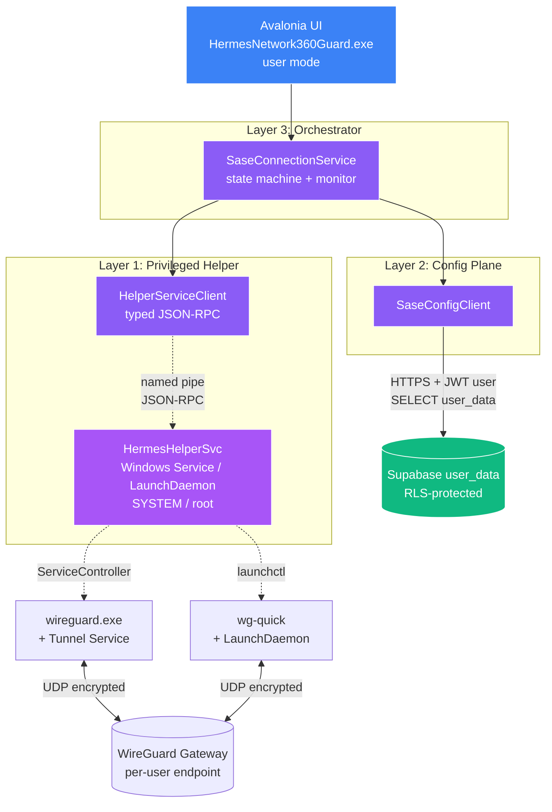
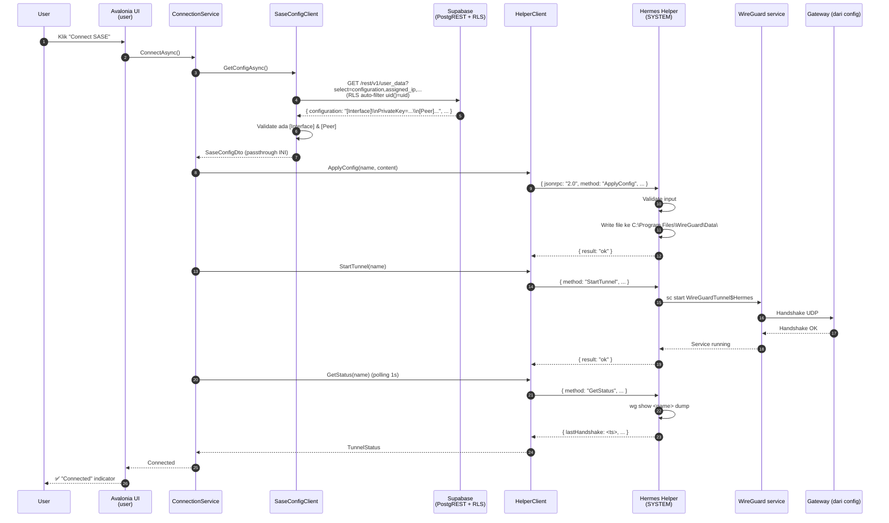
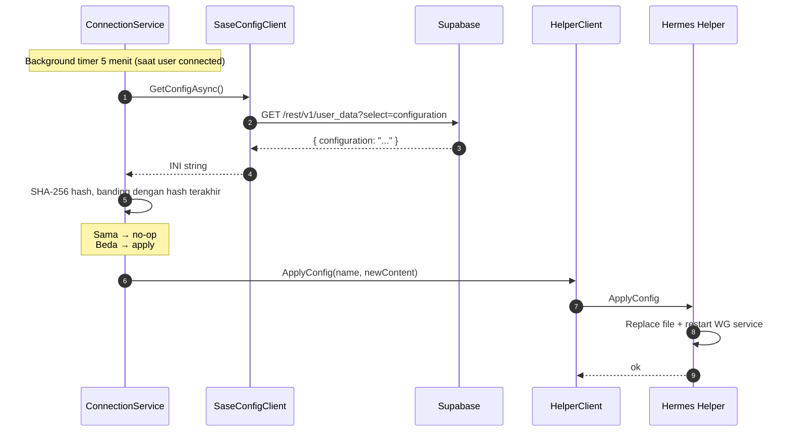

# 2. Arsitektur
{: .no_toc }

## Daftar Isi
{: .no_toc .text-delta }

1. TOC
{:toc}

---

## 2.1 Constraint deployment

Empat constraint yang membentuk arsitektur ini (lihat [Bab 1]({{ site.baseurl }}) §1.1 dan inspeksi schema production):

1. **Supabase self-hosted** → tidak ada Edge Function. Komunikasi backend = direct PostgREST query, dilindungi RLS yang sudah aktif.
2. **UI tidak run as admin** → operasi privileged WireGuard butuh komponen helper terpisah dengan privilege SYSTEM/root.
3. **WG config per-user di `user_data.configuration`** (text, full INI string termasuk PrivateKey, Address, DNS, Peer block) → tidak ada gateway terpusat di kode; client baca config, passthrough ke Helper apa adanya.
4. **Schema Supabase TIDAK BOLEH DIUBAH** → kode harus pakai kolom yang sudah ada (`uid`, `configuration`, `assigned_ip`, `sase_slice_id`, `sase_version`); RLS yang sudah aktif (`uid() = uid`) auto-filter; tidak ada migration / `ALTER TABLE` / trigger baru / kolom tambahan / tabel baru yang akan dibuat.

## 2.2 Arsitektur saat ini (sebelum refactor)

```mermaid
flowchart TB
    UI[Avalonia UI<br/>HermesNetwork360Guard.exe<br/>user mode]
    SE[ServiceEngine.exe<br/>Windows Service / SYSTEM]
    WGS[WireGuard Tunnel Service<br/>WireGuardTunnel$Hermes]
    CONF[wg0.conf<br/>STATIS, di-install sekali]

    SB[(Supabase user_data<br/>WG config per-user)]

    UI -.JSON IPC<br/>magic strings.->|Code:Z1398V| SE
    SE -->|sc start| WGS
    WGS -->|baca| CONF
    UI -->|HTTPS auth| SB

    style UI fill:#3b82f6,stroke:#fff,color:#fff
    style SE fill:#dc2626,stroke:#fff,color:#fff
    style CONF fill:#dc2626,stroke:#fff,color:#fff
    style SB fill:#10b981,stroke:#fff,color:#fff
```

**Karakteristik:**
- IPC tanpa kontrak, magic strings
- ServiceEngine punya banyak responsibility (RMM + SASE + XDR + dll)
- Config statis di-install sekali, tidak refresh dari user_data

## 2.3 Arsitektur baru (target)



**Karakteristik:**
- **Empat komponen jelas:** UI (user), Helper (SYSTEM), Supabase, WireGuard
- **IPC bersih:** named-pipe dengan typed JSON-RPC, schema versioned
- **Config dinamis:** read dari Supabase `user_data` saat login + on-demand
- **Surface area Helper minimal:** hanya verb terbatas untuk privileged ops
- **Tidak ada Edge Function:** PostgREST + RLS sudah cukup

## 2.4 Empat komponen: tanggung jawab

### Komponen A — Hermes UI (Avalonia, user mode)

Run di context user biasa. Tidak punya privilege admin.

**Yang dilakukan:**
- Login Supabase, simpan JWT di OS keychain
- Read `user_data` user lewat HTTPS + JWT
- Parse WG config dari `user_data.wg_config`
- Generate per-device WireGuard keypair (`wg genkey`), simpan local DPAPI/Keychain
- (Opsional) Write public key kembali ke `user_data` via `UPDATE`
- Request operasi privileged ke Hermes Helper via named-pipe IPC
- Tampilkan UI status (Connected/Disconnected, last handshake, throughput)

**Yang TIDAK dilakukan:**
- Tidak install/start/stop Windows service
- Tidak write config ke `C:\Program Files\WireGuard\Data\`
- Tidak shell out ke `wireguard.exe`/`wg-quick`
- Tidak pegang API key SASE / token privileged

### Komponen B — Hermes Helper Service (SYSTEM/root)

Komponen baru yang menggantikan peran SASE-relevant di `ServiceEngine.exe` lama, tapi dengan **kontrak typed dan scope minimal**.

| Platform | Bentuk | Cara install |
|---|---|---|
| Windows | `HermesHelperSvc.exe` jalan sebagai Windows Service `LocalSystem` | Installer `.msi` register service, start otomatis di reboot |
| macOS | LaunchDaemon `com.hermesnetwork.helper` jalan sebagai `root` | `.pkg` installer drop plist + binary, `launchctl bootstrap` |

**Yang dilakukan (verb terbatas):**

```typescript
// Schema kontrak JSON-RPC v1
type Verb =
  | "Ping"                                  // health check
  | "InstallTunnel" | "UninstallTunnel"
  | "ApplyConfig"
  | "StartTunnel" | "StopTunnel"
  | "GetStatus";
```

**Yang TIDAK dilakukan:**
- Tidak shell-out arbitrary command
- Tidak baca/tulis file di luar lokasi WireGuard yang resmi
- Tidak akses Supabase / network external (semua state input dari UI)
- Tidak cache state (stateless — tiap request fresh)

**Prinsip desain:**
- **Authenticate caller**: terima request hanya dari local user yang sama (Win: token check, Mac: peer credential check)
- **Whitelist input**: nama tunnel hanya regex `[A-Za-z0-9_-]{1,32}`, config divalidasi sebagai INI WireGuard valid
- **Audit log**: tiap request tercatat ke Event Viewer (Win) / `os_log` (Mac)

**Lokasi rekomendasi di repo:**
```
HermesHelperSvc/                           ← project terpisah dari HermesNetwork
├── HermesHelperSvc.csproj
├── Program.cs                             ← Windows Service / launchd entry
├── Rpc/
│   ├── JsonRpcServer.cs                   ← named-pipe / unix-socket listener
│   ├── RpcRequest.cs / RpcResponse.cs     ← contract
│   └── Handlers/
│       ├── PingHandler.cs
│       ├── TunnelInstallHandler.cs
│       ├── TunnelStartStopHandler.cs
│       └── TunnelStatusHandler.cs
├── Os/
│   ├── IOsBackend.cs
│   ├── WindowsBackend.cs                  ← wireguard.exe / sc.exe / ServiceController
│   └── MacBackend.cs                      ← wg-quick / launchctl
└── Auth/
    └── CallerAuthenticator.cs             ← validate same-user / same-machine
```

Detail implementasi di [Bab 4 — Helper Service]({{ site.baseurl }}).

### Komponen C — `SaseConfigClient` (di UI app)

**Tanggung jawab:** Baca per-user config dari Supabase `user_data.configuration`.

| Yang dilakukan | Yang TIDAK dilakukan |
|---|---|
| `GET /rest/v1/user_data?select=configuration,assigned_ip,sase_slice_id,sase_version&limit=1` (RLS auto-filter via `uid() = uid`) | Generate WG keypair sendiri (admin manage, PrivateKey ada di `configuration`) |
| Validate INI string ada `[Interface]` & `[Peer]` | Parse / modify config (passthrough apa adanya ke Helper) |
| Polling tiap 5 menit untuk detect perubahan (Realtime tidak aktif) | `INSERT` / `UPDATE` / `DELETE` ke `user_data` |
| Hash config (SHA-256) untuk skip re-apply kalau sama | Pegang API key privileged |

**Lokasi:**
```
HermesNetwork/
└── Sase/
    └── Config/
        ├── SaseConfigClient.cs
        ├── ISaseConfigClient.cs
        └── Models/
            └── SaseConfigDto.cs
```

**Catatan:** Tidak ada `KeyStore.cs` / `KeyPairGenerator.cs` / `DeviceIdHelper.cs` — admin yang manage keypair, pre-populated di `configuration` text.

Detail di [Bab 5 — Config Service]({{ site.baseurl }}).

### Komponen D — `SaseConnectionService` (orchestrator)

**Tanggung jawab:** State machine + background monitor, glue antara A/B/C.

```
HermesNetwork/Sase/SaseConnectionService.cs
```

Logika tipikal `ConnectAsync()`:
1. `SaseConfigClient.GetConfigAsync()` → dapat config terbaru dari user_data
2. (Opsional) Inject local PrivateKey dari KeyStore ke config string
3. `HelperServiceClient.ApplyConfigAsync(name, content)` → Helper write config + reload
4. `HelperServiceClient.StartTunnelAsync(name)` → Helper `sc start` / `launchctl kickstart`
5. Polling `HelperServiceClient.GetStatusAsync(name)` sampai handshake fresh
6. Spawn background monitor task

Detail di [Bab 6 — Connection Flow]({{ site.baseurl }}).

## 2.5 Aliran data: "user klik Connect SASE"



**Catatan:**
- **PrivateKey WG ada di `user_data.configuration` di Supabase**, di-generate dan di-populate oleh admin tooling (di luar scope dokumen ini). Client tidak generate keypair lokal.
- **API key SASE TIDAK ada di client** — gateway peer config sudah tersimpan di `user_data.configuration` per user, di-populate oleh admin lewat tooling lain.
- Helper hanya tahu "apply config X, start tunnel Y" — tidak tahu siapa user atau apa policy.
- Threat model konsekuensi: kalau Supabase compromise, semua PrivateKey user bocor. Lihat [Bab 7]({{ site.baseurl }}) untuk diskusi.

## 2.6 Aliran data: "config refresh otomatis" (polling — Realtime tidak aktif)

Realtime di Supabase self-hosted production **tidak aktif** untuk semua tabel. Refresh dilakukan dengan polling background tiap 5 menit + hash compare:



Hash compare di client menghindari unnecessary tunnel restart. Polling 5 menit cukup karena admin update jarang.

## 2.7 Trade-off & rationale

| Keputusan | Alternatif | Alasan |
|---|---|---|
| Hermes Helper Service terpisah | UAC dialog tiap operasi | UAC tiap klik = UX rusak. Helper sekali install, jalan persistent. |
| Direct PostgREST query (no Edge Function) | Bikin REST service standalone | Self-hosted Supabase support PostgREST + RLS lengkap. Tidak perlu deploy lebih banyak. |
| Named-pipe + JSON-RPC | gRPC, REST-over-HTTP, COM | Named-pipe = built-in OS authentication, ringan, sudah pattern di Windows. JSON-RPC = simple kontrak. |
| Keypair pre-generated admin di `user_data.configuration` | Client generate keypair lokal + publish pubkey | Realitas production: PrivateKey sudah ada di Supabase. Schema tidak boleh diubah, kolom `wg_public_key` tidak ada. Client passthrough INI apa adanya. |
| Stateless Helper | Helper cache state | Stateless = mudah di-audit, lebih sedikit bug. |
| Verb whitelist Helper | Generic "RunCommand" | Generic = backdoor risk. Whitelist = audit trail jelas. |
| Tetap WireGuard | OpenZiti / Tailscale / NetBird | WireGuard sudah running, tested, fast. |

## 2.8 Apa yang TIDAK berubah

- ✅ WireGuard data plane: binary `wireguard.exe` / `wg-quick` resmi
- ✅ Crypto WireGuard
- ✅ **Supabase `user_data` schema** — semua 23 kolom existing tetap apa adanya. **Tidak ada migration.** Tidak ada kolom baru. Tidak ada trigger baru. Tidak ada policy baru. RLS yang sudah aktif (`uid() = uid`) cukup.
- ✅ Tab UI Avalonia struktur
- ✅ Admin tooling yang populate `user_data.configuration` (di luar scope dokumen ini)

## 2.9 Apa yang berubah

- ❌ `ServiceEngine.exe` SASE-related — DIHAPUS, diganti `HermesHelperSvc`
- ❌ Custom IPC `Code: "Z1398V"` magic strings — DIHAPUS, diganti typed JSON-RPC
- ➕ `HermesHelperSvc/` — project baru untuk Helper Service
- ➕ `HermesNetwork/Sase/Helper/` — client side untuk panggil Helper
- ➕ `HermesNetwork/Sase/Config/` — Supabase user_data reader (passthrough INI)
- 🔄 Lifecycle WireGuard: lewat Helper IPC menggantikan `IpcComService`

**Apa yang TIDAK ditambahkan** (dropped dari versi sebelumnya):
- ~~Per-device WG keypair generation di client (DPAPI/Keychain)~~ — admin yang manage, sudah di `configuration`
- ~~`KeyStore.cs`, `KeyPairGenerator.cs`, `DeviceIdHelper.cs`~~ — tidak perlu
- ~~Schema migration (`ALTER TABLE`, kolom `wg_public_key`/`wg_status`/`wg_last_handshake`, trigger `protect_wg_config`, tabel `sase_peer`/`sase_audit_log`)~~ — tidak diizinkan, schema dilarang diubah
- ~~PSK rotation~~ — production config tidak pakai PSK
- ~~Realtime subscription~~ — tidak aktif di self-hosted, pakai polling 5 menit

---

[← Bab 1 Pendahuluan]({{ site.baseurl }}){: .btn }
[Bab 3 — Prasyarat →]({{ site.baseurl }}){: .btn .btn-primary }
