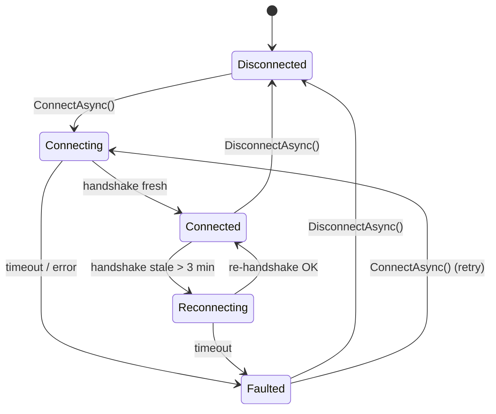
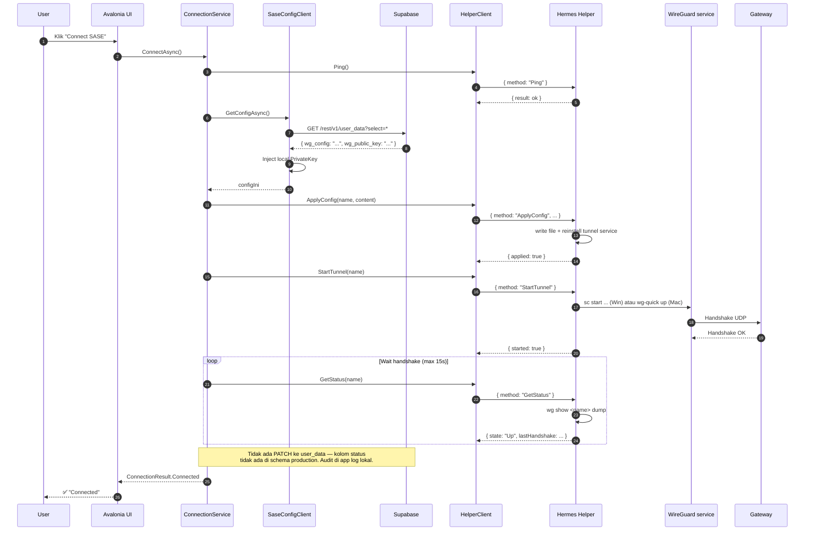

# 6. Connection Flow (Orchestrator)
{: .no_toc }

## Daftar Isi
{: .no_toc .text-delta }

1. TOC
{:toc}

---

## 6.1 Tujuan

`SaseConnectionService` adalah **orchestrator level UI** yang menggabungkan:
- `SaseConfigClient` (Layer 2 — read config dari Supabase)
- `IHelperServiceClient` (Layer 1 — Helper Service IPC)

Menjadi state machine bersih yang mudah dipakai dari ViewModel.

State diagram:



## 6.2 Public surface

```csharp
namespace HermesNetwork.Sase;

public interface ISaseConnectionService
{
    IObservable<SaseConnectionState> StateChanges { get; }
    SaseConnectionState CurrentState { get; }

    Task<ConnectionResult> ConnectAsync(CancellationToken ct = default);
    Task DisconnectAsync(CancellationToken ct = default);
    Task RefreshStatusAsync(CancellationToken ct = default);
    Task<ConnectionResult> RefreshConfigAsync(CancellationToken ct = default);
}

public sealed record SaseConnectionState(
    SaseStatus Status,
    DateTimeOffset? LastHandshake,
    long BytesSent,
    long BytesReceived,
    string? ErrorMessage = null);

public enum SaseStatus { Disconnected, Connecting, Connected, Reconnecting, Faulted }

public sealed record ConnectionResult(
    bool Success, SaseStatus FinalStatus, string? Message = null)
{
    public static ConnectionResult Connected(DateTimeOffset hs)
        => new(true, SaseStatus.Connected, $"Handshake at {hs:O}");
    public static ConnectionResult Failed(string r)
        => new(false, SaseStatus.Faulted, r);
    public static readonly ConnectionResult HandshakeTimeout
        = new(false, SaseStatus.Faulted, "Handshake timeout");
}
```

## 6.3 Implementasi

```csharp
using System.Reactive.Subjects;
using HermesNetwork.Sase.Config;
using HermesNetwork.Sase.Helper;

namespace HermesNetwork.Sase;

public sealed class SaseConnectionService : ISaseConnectionService, IAsyncDisposable
{
    private const string TunnelName = "Hermes";
    private const int MonitorIntervalSeconds = 20;
    private const int ConfigCheckIntervalMinutes = 5;

    private readonly IHelperServiceClient _helper;
    private readonly ISaseConfigClient _config;
    private readonly ILogger<SaseConnectionService> _log;

    private readonly BehaviorSubject<SaseConnectionState> _stateSubject;
    private readonly object _lock = new();
    private CancellationTokenSource? _monitorCts;

    public IObservable<SaseConnectionState> StateChanges => _stateSubject;
    public SaseConnectionState CurrentState => _stateSubject.Value;

    private string? _lastConfigHash;

    public SaseConnectionService(
        IHelperServiceClient helper,
        ISaseConfigClient config,
        ILogger<SaseConnectionService> log)
    {
        _helper = helper; _config = config; _log = log;
        _stateSubject = new BehaviorSubject<SaseConnectionState>(
            new SaseConnectionState(SaseStatus.Disconnected, null, 0, 0));
    }

    private static string ComputeHash(string s) =>
        Convert.ToBase64String(System.Security.Cryptography.SHA256.HashData(
            System.Text.Encoding.UTF8.GetBytes(s)));

    public async Task<ConnectionResult> ConnectAsync(CancellationToken ct = default)
    {
        SetState(SaseStatus.Connecting);
        try
        {
            // 1. Verify Helper alive
            await _helper.PingAsync(ct);

            // 2. Get config dari Supabase user_data.configuration (passthrough INI)
            var configIni = await _config.GetConfigAsync(ct);
            _lastConfigHash = ComputeHash(configIni);

            // 3. Apply ke Helper (uninstall + reinstall tunnel di Win)
            await _helper.ApplyConfigAsync(TunnelName, configIni, ct);

            // 4. Start tunnel
            await _helper.StartTunnelAsync(TunnelName, ct);

            // 5. Wait for handshake
            var hs = await WaitHandshakeAsync(TimeSpan.FromSeconds(15), ct);

            SetState(SaseStatus.Connected, lastHandshake: hs);
            _log.LogInformation("SASE connected, handshake at {HS}", hs);

            // 6. Tidak ada ReportStatusAsync — kolom wg_status / wg_last_handshake
            //    tidak ada di schema production. Status dilog di app log lokal saja.

            // 7. Start background monitor
            StartMonitor();

            return ConnectionResult.Connected(hs);
        }
        catch (TimeoutException)
        {
            SetState(SaseStatus.Faulted, error: "Handshake timeout");
            // (skip Supabase report — kolom status tidak ada di schema production)
            return ConnectionResult.HandshakeTimeout;
        }
        catch (HelperRpcException rx)
        {
            _log.LogError("Helper RPC error: code={Code} msg={Msg}", rx.Code, rx.Message);
            SetState(SaseStatus.Faulted, error: $"Helper: {rx.Message}");
            return ConnectionResult.Failed(rx.Message);
        }
        catch (Exception ex)
        {
            _log.LogError(ex, "SASE connect failed");
            SetState(SaseStatus.Faulted, error: ex.Message);
            return ConnectionResult.Failed(ex.Message);
        }
    }

    public async Task DisconnectAsync(CancellationToken ct = default)
    {
        StopMonitor();
        try
        {
            await _helper.StopTunnelAsync(TunnelName, ct);
            // (skip Supabase report — kolom status tidak ada di schema production)
        }
        finally
        {
            SetState(SaseStatus.Disconnected);
        }
    }

    public async Task RefreshStatusAsync(CancellationToken ct = default)
    {
        try
        {
            var st = await _helper.GetStatusAsync(TunnelName, ct);
            var status = st.State switch
            {
                "Up"        => SaseStatus.Connected,
                "Stopped"   => SaseStatus.Disconnected,
                "Starting"  => SaseStatus.Connecting,
                "Faulted"   => SaseStatus.Faulted,
                _           => SaseStatus.Disconnected,
            };
            SetState(status, st.LastHandshake, st.BytesReceived, st.BytesSent);

            if (status == SaseStatus.Connected && _monitorCts is null)
                StartMonitor();
        }
        catch (Exception ex)
        {
            _log.LogWarning(ex, "RefreshStatus failed");
        }
    }

    public async Task<ConnectionResult> RefreshConfigAsync(CancellationToken ct = default)
    {
        if (CurrentState.Status != SaseStatus.Connected)
            return ConnectionResult.Failed("Not connected");

        try
        {
            var newConfig = await _config.GetConfigAsync(ct);
            await _helper.ApplyConfigAsync(TunnelName, newConfig, ct);
            // ApplyConfig di Win uninstall+reinstall service → handshake fresh
            await _helper.StartTunnelAsync(TunnelName, ct);
            var hs = await WaitHandshakeAsync(TimeSpan.FromSeconds(15), ct);
            SetState(SaseStatus.Connected, lastHandshake: hs);
            return ConnectionResult.Connected(hs);
        }
        catch (Exception ex)
        {
            SetState(SaseStatus.Faulted, error: ex.Message);
            return ConnectionResult.Failed(ex.Message);
        }
    }

    // === helpers ===

    private async Task<DateTimeOffset> WaitHandshakeAsync(TimeSpan timeout, CancellationToken ct)
    {
        var deadline = DateTime.UtcNow + timeout;
        while (DateTime.UtcNow < deadline)
        {
            ct.ThrowIfCancellationRequested();
            var st = await _helper.GetStatusAsync(TunnelName, ct);
            if (st.LastHandshake is { } hs && hs > DateTimeOffset.UtcNow.AddMinutes(-3))
                return hs;
            await Task.Delay(1_000, ct);
        }
        throw new TimeoutException("Handshake timeout");
    }

    private void StartMonitor()
    {
        lock (_lock)
        {
            if (_monitorCts is not null) return;
            _monitorCts = new CancellationTokenSource();
        }
        _ = Task.Run(() => MonitorLoopAsync(_monitorCts.Token));
    }

    private void StopMonitor()
    {
        lock (_lock)
        {
            _monitorCts?.Cancel();
            _monitorCts?.Dispose();
            _monitorCts = null;
        }
    }

    private async Task MonitorLoopAsync(CancellationToken ct)
    {
        var lastConfigCheck = DateTime.UtcNow;
        while (!ct.IsCancellationRequested)
        {
            try
            {
                await Task.Delay(TimeSpan.FromSeconds(MonitorIntervalSeconds), ct);

                var st = await _helper.GetStatusAsync(TunnelName, ct);
                var stale = st.LastHandshake is null
                         || DateTimeOffset.UtcNow - st.LastHandshake > TimeSpan.FromMinutes(3);

                if (st.State == "Up" && stale)
                {
                    _log.LogWarning("Handshake stale, attempting reconnect");
                    SetState(SaseStatus.Reconnecting);
                    try
                    {
                        await _helper.StopTunnelAsync(TunnelName, ct);
                        await _helper.StartTunnelAsync(TunnelName, ct);
                        var hs = await WaitHandshakeAsync(TimeSpan.FromSeconds(15), ct);
                        SetState(SaseStatus.Connected, lastHandshake: hs);
                    }
                    catch (TimeoutException)
                    {
                        SetState(SaseStatus.Faulted, error: "Reconnect timeout");
                    }
                }
                else
                {
                    var status = st.State == "Up" ? SaseStatus.Connected : SaseStatus.Faulted;
                    SetState(status, st.LastHandshake, st.BytesReceived, st.BytesSent);
                }

                // (skip periodic Supabase report — kolom status tidak ada
                //  di schema production. App log lokal sudah cukup untuk audit.)

                // Periodic config refresh check (Realtime tidak aktif → polling)
                if (DateTime.UtcNow - lastConfigCheck > TimeSpan.FromMinutes(ConfigCheckIntervalMinutes))
                {
                    lastConfigCheck = DateTime.UtcNow;
                    try
                    {
                        var fresh = await _config.GetConfigAsync(ct);
                        var freshHash = ComputeHash(fresh);
                        if (freshHash != _lastConfigHash)
                        {
                            _log.LogInformation("Config changed in user_data, applying");
                            await _helper.ApplyConfigAsync(TunnelName, fresh, ct);
                            await _helper.StartTunnelAsync(TunnelName, ct);
                            var hs = await WaitHandshakeAsync(TimeSpan.FromSeconds(15), ct);
                            SetState(SaseStatus.Connected, lastHandshake: hs);
                            _lastConfigHash = freshHash;
                        }
                    }
                    catch (Exception ex)
                    {
                        _log.LogWarning(ex, "Config refresh check failed (non-fatal)");
                    }
                }
            }
            catch (OperationCanceledException) { /* shutdown */ }
            catch (Exception ex)
            {
                _log.LogError(ex, "Monitor loop error");
            }
        }
    }

    private void SetState(SaseStatus status,
        DateTimeOffset? lastHandshake = null, long? rx = null, long? tx = null,
        string? error = null)
    {
        var current = _stateSubject.Value;
        _stateSubject.OnNext(new SaseConnectionState(
            status,
            lastHandshake ?? current.LastHandshake,
            tx ?? current.BytesSent,
            rx ?? current.BytesReceived,
            error));
    }

    public async ValueTask DisposeAsync()
    {
        StopMonitor();
        _stateSubject.Dispose();
        await ValueTask.CompletedTask;
    }
}
```

## 6.4 Sequence diagram lengkap



## 6.5 Penggunaan dari ViewModel

```csharp
public sealed partial class SaseTabViewModel : ViewModelBase
{
    private readonly ISaseConnectionService _conn;
    private readonly IDisposable _stateSub;

    [ObservableProperty] private string _statusText = "Disconnected";
    [ObservableProperty] private string? _lastHandshakeText;
    [ObservableProperty] private string? _throughputText;
    [ObservableProperty] private string? _errorText;
    [ObservableProperty] private bool _canConnect = true;
    [ObservableProperty] private bool _canDisconnect;

    public SaseTabViewModel(ISaseConnectionService conn)
    {
        _conn = conn;
        _stateSub = _conn.StateChanges.Subscribe(OnStateChanged);
        OnStateChanged(_conn.CurrentState);
    }

    private void OnStateChanged(SaseConnectionState s)
    {
        StatusText = s.Status.ToString();
        LastHandshakeText = s.LastHandshake?.ToString("HH:mm:ss") ?? "-";
        ThroughputText = $"↓ {Bytes(s.BytesReceived)} / ↑ {Bytes(s.BytesSent)}";
        ErrorText = s.ErrorMessage;
        CanConnect = s.Status is SaseStatus.Disconnected or SaseStatus.Faulted;
        CanDisconnect = s.Status is SaseStatus.Connected or SaseStatus.Reconnecting;
    }

    [RelayCommand(CanExecute = nameof(CanConnect))]
    private Task Connect() => _conn.ConnectAsync();

    [RelayCommand(CanExecute = nameof(CanDisconnect))]
    private Task Disconnect() => _conn.DisconnectAsync();

    [RelayCommand]
    private Task RefreshConfig() => _conn.RefreshConfigAsync();

    private static string Bytes(long b) =>
        b < 1024 ? $"{b} B"
      : b < 1024 * 1024 ? $"{b / 1024.0:F1} KB"
      : b < 1024L * 1024 * 1024 ? $"{b / 1024.0 / 1024:F1} MB"
      : $"{b / 1024.0 / 1024 / 1024:F2} GB";
}
```

## 6.6 Network change handling

Hook ke OS event saat user pindah jaringan (WiFi → 4G):

```csharp
using System.Net.NetworkInformation;

NetworkChange.NetworkAddressChanged += async (s, e) =>
{
    if (CurrentState.Status != SaseStatus.Connected) return;

    _log.LogInformation("Network change detected, verifying SASE handshake");
    await Task.Delay(2_000);   // beri waktu OS settle

    var st = await _helper.GetStatusAsync(TunnelName);
    if (st.LastHandshake is null ||
        DateTimeOffset.UtcNow - st.LastHandshake > TimeSpan.FromMinutes(2))
    {
        _log.LogInformation("Forcing reconnect after network change");
        await DisconnectAsync();
        await ConnectAsync();
    }
};
```

WireGuard biasanya self-heal lewat PersistentKeepalive (25s), tapi handshake explicit reconnect lebih reliable saat IP user berubah drastis.

## 6.7 Connection lifecycle: app start vs login vs reconnect

| Event | Yang terjadi |
|---|---|
| App start (sebelum login) | `SaseConnectionService` di-construct tapi `ConnectAsync` tidak jalan |
| User login (Supabase JWT acquired) | Bisa polling Helper status — kalau tunnel sudah Up dari session sebelumnya, sync state ke "Connected" |
| User klik Connect | Full flow: read config → apply → start → wait handshake |
| App close | `Dispose` → background monitor stop, **tunnel TETAP up** karena di-manage Helper sebagai service |
| App reopen | `RefreshStatusAsync` → kalau Helper bilang Up, langsung tampilkan "Connected" |
| User logout | `DisconnectAsync` → tunnel down |
| Reboot | LaunchDaemon (Mac) atau Win Service auto-start tunnel kalau di-config; UI sync state saat reopen |

## 6.8 Testing

### 6.8.1 Mock-based unit tests

```csharp
public class SaseConnectionServiceTests
{
    [Fact]
    public async Task ConnectAsync_HappyPath_ReachesConnected()
    {
        var helper = new Mock<IHelperServiceClient>();
        helper.Setup(h => h.GetStatusAsync(It.IsAny<string>(), It.IsAny<CancellationToken>()))
              .ReturnsAsync(new TunnelStatusDto("Hermes", "Up",
                  DateTimeOffset.UtcNow, 0, 0, 1, "10.99.0.42/32"));

        var config = new Mock<ISaseConfigClient>();
        config.Setup(c => c.GetConfigAsync(It.IsAny<CancellationToken>()))
              .ReturnsAsync("[Interface]\nPrivateKey = AAA=\nAddress = 10.99.0.42/32\n[Peer]\n...");

        var sut = new SaseConnectionService(helper.Object, config.Object, NullLogger);
        var result = await sut.ConnectAsync();

        result.Success.Should().BeTrue();
        result.FinalStatus.Should().Be(SaseStatus.Connected);
        helper.Verify(h => h.ApplyConfigAsync(It.IsAny<string>(), It.IsAny<string>(), It.IsAny<CancellationToken>()), Times.Once);
        helper.Verify(h => h.StartTunnelAsync(It.IsAny<string>(), It.IsAny<CancellationToken>()), Times.Once);
    }

    [Fact]
    public async Task ConnectAsync_HandshakeTimeout_ReturnsFault()
    {
        var helper = new Mock<IHelperServiceClient>();
        helper.Setup(h => h.GetStatusAsync(It.IsAny<string>(), It.IsAny<CancellationToken>()))
              .ReturnsAsync(new TunnelStatusDto("Hermes", "Up", null, 0, 0, 1, null));   // never handshake
        // ... assert timeout
    }
}
```

### 6.8.2 Manual smoke test

1. Install Hermes Guard + Helper Service di Win VM
2. Login user test (yang punya `wg_config` di user_data)
3. Buka tab SASE
4. Klik Connect
5. Verifikasi: status "Connected", `wg show` show handshake, `curl ifconfig.me` show gateway IP
6. Disable WiFi 30 detik → enable
7. Tunggu monitor detect → reconnect otomatis
8. Edit `user_data.wg_config` di Supabase (admin)
9. Tunggu max 5 menit → tunnel auto-refresh dengan config baru

## 6.9 Best practices

- **Singleton ConnectionService** di DI — satu state machine untuk seluruh app
- **Subscribe StateChanges di ViewModel** — UI auto-update saat state berubah
- **Log byte counters periodic** ke Supabase (sample 1× per jam) untuk audit usage
- **Cap reconnect attempts** — max 3 retry dengan exp back-off
- **Notify user via toast** kalau auto-reconnect gagal
- **Background monitor stop saat app minimize** untuk hemat battery (opsional)

---

[← Bab 5 Config Service]({{ site.baseurl }}){: .btn }
[Bab 7 — Keamanan →]({{ site.baseurl }}){: .btn .btn-primary }
