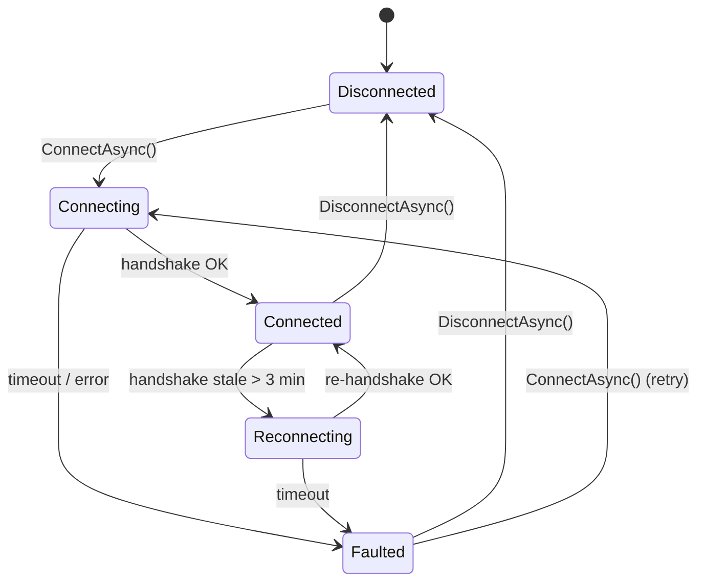

# 6. Layer 3 — Connection Flow
{: .no_toc }

## Daftar Isi
{: .no_toc .text-delta }

1. TOC
{:toc}

---

## 6.1 Tujuan

`SaseConnectionService` adalah orchestrator level UI yang menggabungkan Layer 1 + Layer 2 menjadi state machine yang mudah dipakai dari ViewModel.

State diagram:



## 6.2 Public surface

```csharp
namespace HermesNetwork.Sase;

public interface ISaseConnectionService
{
    /// <summary>Reactive: state perubahan ter-publish.</summary>
    IObservable<SaseConnectionState> StateChanges { get; }

    SaseConnectionState CurrentState { get; }

    Task<ConnectionResult> ConnectAsync(CancellationToken ct = default);
    Task DisconnectAsync(CancellationToken ct = default);

    /// <summary>Cek state aktual + sinkronisasi (dipanggil saat tab dibuka).</summary>
    Task RefreshStatusAsync(CancellationToken ct = default);

    /// <summary>Manual force refresh config (mis. user klik "Refresh policy").</summary>
    Task<ConnectionResult> RefreshConfigAsync(CancellationToken ct = default);
}

public sealed record SaseConnectionState(
    SaseStatus Status,
    DateTimeOffset? LastHandshake,
    long BytesSent,
    long BytesReceived,
    string? ErrorMessage = null);

public enum SaseStatus
{
    Disconnected,
    Connecting,
    Connected,
    Reconnecting,
    Faulted
}

public sealed record ConnectionResult(
    bool Success,
    SaseStatus FinalStatus,
    string? Message = null)
{
    public static ConnectionResult Connected(DateTimeOffset hsTime)
        => new(true, SaseStatus.Connected, $"Handshake at {hsTime:O}");

    public static ConnectionResult Failed(string reason)
        => new(false, SaseStatus.Faulted, reason);

    public static readonly ConnectionResult HandshakeTimeout
        = new(false, SaseStatus.Faulted, "Handshake timeout");
}
```

## 6.3 Implementasi

```csharp
using System;
using System.Reactive.Subjects;
using System.Threading;
using System.Threading.Tasks;
using HermesNetwork.Sase.Config;
using HermesNetwork.Sase.Supervisor;
using Microsoft.Extensions.Logging;

namespace HermesNetwork.Sase;

public sealed class SaseConnectionService : ISaseConnectionService, IAsyncDisposable
{
    private readonly ITunnelSupervisor _supervisor;
    private readonly ISaseConfigClient _config;
    private readonly ILogger<SaseConnectionService> _log;

    private readonly BehaviorSubject<SaseConnectionState> _stateSubject;
    private readonly object _lock = new();
    private CancellationTokenSource? _monitorCts;

    public IObservable<SaseConnectionState> StateChanges => _stateSubject;
    public SaseConnectionState CurrentState => _stateSubject.Value;

    public SaseConnectionService(
        ITunnelSupervisor supervisor,
        ISaseConfigClient config,
        ILogger<SaseConnectionService> log)
    {
        _supervisor = supervisor;
        _config = config;
        _log = log;
        _stateSubject = new BehaviorSubject<SaseConnectionState>(
            new SaseConnectionState(SaseStatus.Disconnected, null, 0, 0));
    }

    public async Task<ConnectionResult> ConnectAsync(CancellationToken ct = default)
    {
        SetState(SaseStatus.Connecting);

        try
        {
            // 1. Get config
            var configDto = await _config.RequestConfigAsync(ct);
            var wgConfig  = WgConfigBuilder.Build(configDto);

            // 2. Apply
            await _supervisor.ApplyConfigAsync(wgConfig, ct);

            // 3. Start
            await _supervisor.StartAsync(ct);

            // 4. Wait for handshake
            var hsTime = await _supervisor.WaitHandshakeAsync(TimeSpan.FromSeconds(15), ct);

            SetState(SaseStatus.Connected, lastHandshake: hsTime);
            _log.LogInformation("SASE connected at {Time}", hsTime);

            // 5. Start background monitor
            StartMonitor();

            return ConnectionResult.Connected(hsTime);
        }
        catch (TimeoutException)
        {
            SetState(SaseStatus.Faulted, error: "Handshake timeout");
            return ConnectionResult.HandshakeTimeout;
        }
        catch (Exception ex)
        {
            _log.LogError(ex, "SASE connect failed");
            SetState(SaseStatus.Faulted, error: ex.Message);
            return ConnectionResult.Failed(ex.Message);
        }
    }

    public async Task DisconnectAsync(CancellationToken ct = default)
    {
        StopMonitor();
        try
        {
            await _supervisor.StopAsync(ct);
        }
        finally
        {
            SetState(SaseStatus.Disconnected);
        }
    }

    public async Task RefreshStatusAsync(CancellationToken ct = default)
    {
        var st = await _supervisor.GetStatusAsync(ct);
        var status = st.State switch
        {
            TunnelState.Up         => SaseStatus.Connected,
            TunnelState.Stopped    => SaseStatus.Disconnected,
            TunnelState.Starting   => SaseStatus.Connecting,
            TunnelState.Stopping   => SaseStatus.Disconnected,
            TunnelState.Faulted    => SaseStatus.Faulted,
            _                      => SaseStatus.Disconnected,
        };
        SetState(status, st.LastHandshake, st.BytesReceived, st.BytesSent);

        if (status == SaseStatus.Connected && _monitorCts is null)
            StartMonitor();
    }

    public async Task<ConnectionResult> RefreshConfigAsync(CancellationToken ct = default)
    {
        if (CurrentState.Status != SaseStatus.Connected)
        {
            return ConnectionResult.Failed("SASE belum terkoneksi — refresh config tidak relevan");
        }

        try
        {
            var configDto = await _config.RequestConfigAsync(ct);
            var wgConfig  = WgConfigBuilder.Build(configDto);
            await _supervisor.ApplyConfigAsync(wgConfig, ct);

            // ApplyConfigAsync di Windows uninstall+reinstall service — equiv reconnect
            // Wait for new handshake
            var hsTime = await _supervisor.WaitHandshakeAsync(TimeSpan.FromSeconds(15), ct);
            SetState(SaseStatus.Connected, lastHandshake: hsTime);
            return ConnectionResult.Connected(hsTime);
        }
        catch (Exception ex)
        {
            SetState(SaseStatus.Faulted, error: ex.Message);
            return ConnectionResult.Failed(ex.Message);
        }
    }

    // === Background monitor ===

    private void StartMonitor()
    {
        lock (_lock)
        {
            if (_monitorCts is not null) return;
            _monitorCts = new CancellationTokenSource();
        }
        _ = Task.Run(() => MonitorLoopAsync(_monitorCts.Token));
    }

    private void StopMonitor()
    {
        lock (_lock)
        {
            _monitorCts?.Cancel();
            _monitorCts?.Dispose();
            _monitorCts = null;
        }
    }

    private async Task MonitorLoopAsync(CancellationToken ct)
    {
        var statusInterval = TimeSpan.FromSeconds(20);
        var configCheckInterval = TimeSpan.FromMinutes(5);
        var lastConfigCheck = DateTime.UtcNow;

        while (!ct.IsCancellationRequested)
        {
            try
            {
                await Task.Delay(statusInterval, ct);

                // 1. Cek status tunnel
                var st = await _supervisor.GetStatusAsync(ct);
                var stale = st.LastHandshake is null
                         || DateTimeOffset.UtcNow - st.LastHandshake > TimeSpan.FromMinutes(3);

                if (st.State == TunnelState.Up && stale)
                {
                    _log.LogWarning("SASE handshake stale — attempting reconnect");
                    SetState(SaseStatus.Reconnecting);
                    try
                    {
                        await _supervisor.StopAsync(ct);
                        await _supervisor.StartAsync(ct);
                        var hs = await _supervisor.WaitHandshakeAsync(TimeSpan.FromSeconds(15), ct);
                        SetState(SaseStatus.Connected, lastHandshake: hs);
                    }
                    catch (TimeoutException)
                    {
                        SetState(SaseStatus.Faulted, error: "Reconnect timeout");
                    }
                }
                else
                {
                    SetState(
                        st.State == TunnelState.Up ? SaseStatus.Connected : SaseStatus.Faulted,
                        st.LastHandshake, st.BytesReceived, st.BytesSent);
                }

                // 2. Cek apakah config masih fresh (interval lebih lama)
                if (DateTime.UtcNow - lastConfigCheck > configCheckInterval)
                {
                    lastConfigCheck = DateTime.UtcNow;
                    var fresh = await _config.IsConfigFreshAsync(ct);
                    if (!fresh)
                    {
                        _log.LogInformation("SASE config stale — refreshing");
                        await RefreshConfigAsync(ct);
                    }
                }
            }
            catch (OperationCanceledException) { /* shutdown */ }
            catch (Exception ex)
            {
                _log.LogError(ex, "SASE monitor loop error");
            }
        }
    }

    private void SetState(
        SaseStatus status,
        DateTimeOffset? lastHandshake = null,
        long? rx = null,
        long? tx = null,
        string? error = null)
    {
        var current = _stateSubject.Value;
        var next = new SaseConnectionState(
            status,
            lastHandshake ?? current.LastHandshake,
            tx ?? current.BytesSent,
            rx ?? current.BytesReceived,
            error);
        _stateSubject.OnNext(next);
    }

    public async ValueTask DisposeAsync()
    {
        StopMonitor();
        _stateSubject.Dispose();
        await ValueTask.CompletedTask;
    }
}
```

## 6.4 Penggunaan dari ViewModel

```csharp
public sealed partial class SaseTabViewModel : ViewModelBase
{
    private readonly ISaseConnectionService _conn;
    private readonly IDisposable _stateSub;

    [ObservableProperty] private string _statusText = "Disconnected";
    [ObservableProperty] private string? _lastHandshakeText;
    [ObservableProperty] private string? _throughputText;
    [ObservableProperty] private bool _canConnect = true;
    [ObservableProperty] private bool _canDisconnect;

    public SaseTabViewModel(ISaseConnectionService conn)
    {
        _conn = conn;
        _stateSub = _conn.StateChanges.Subscribe(OnStateChanged);
        OnStateChanged(_conn.CurrentState);
    }

    private void OnStateChanged(SaseConnectionState state)
    {
        StatusText = state.Status.ToString();
        LastHandshakeText = state.LastHandshake?.ToString("HH:mm:ss") ?? "-";
        ThroughputText = $"↓ {Bytes(state.BytesReceived)} / ↑ {Bytes(state.BytesSent)}";
        CanConnect = state.Status is SaseStatus.Disconnected or SaseStatus.Faulted;
        CanDisconnect = state.Status is SaseStatus.Connected or SaseStatus.Reconnecting;
    }

    [RelayCommand(CanExecute = nameof(CanConnect))]
    private async Task ConnectAsync()
    {
        await _conn.ConnectAsync();
    }

    [RelayCommand(CanExecute = nameof(CanDisconnect))]
    private async Task DisconnectAsync()
    {
        await _conn.DisconnectAsync();
    }

    [RelayCommand]
    private async Task RefreshConfigAsync()
    {
        await _conn.RefreshConfigAsync();
    }

    private static string Bytes(long b) =>
        b < 1024 ? $"{b} B"
      : b < 1024 * 1024 ? $"{b / 1024.0:F1} KB"
      : b < 1024L * 1024 * 1024 ? $"{b / 1024.0 / 1024:F1} MB"
      : $"{b / 1024.0 / 1024 / 1024:F2} GB";

    public override void Dispose()
    {
        _stateSub.Dispose();
        base.Dispose();
    }
}
```

XAML binding (Avalonia):

```xml
<StackPanel Spacing="8" Margin="20">
    <TextBlock Text="{Binding StatusText}" FontSize="20" />
    <TextBlock Text="{Binding LastHandshakeText, StringFormat='Last handshake: {0}'}" />
    <TextBlock Text="{Binding ThroughputText}" />

    <StackPanel Orientation="Horizontal" Spacing="12">
        <Button Content="Connect"    Command="{Binding ConnectCommand}" />
        <Button Content="Disconnect" Command="{Binding DisconnectCommand}" />
        <Button Content="Refresh policy" Command="{Binding RefreshConfigCommand}" />
    </StackPanel>
</StackPanel>
```

## 6.5 Penanganan event jaringan

Saat user pindah jaringan (WiFi → 4G), source IP berubah dan WireGuard biasanya self-heal dalam 25 detik (PersistentKeepalive). Tapi kalau perubahan **drastis** (mis. hilang internet selama 1 jam), kita perlu trigger reconnect manual.

Hook ke OS network change events:

```csharp
using System.Net.NetworkInformation;

NetworkChange.NetworkAddressChanged += async (s, e) =>
{
    _log.LogInformation("Network address changed — verifying SASE handshake");
    await Task.Delay(2000); // beri waktu OS settle
    var st = await _supervisor.GetStatusAsync();
    if (st.State == TunnelState.Up &&
        (st.LastHandshake is null ||
         DateTimeOffset.UtcNow - st.LastHandshake > TimeSpan.FromMinutes(2)))
    {
        // force reconnect
        await DisconnectAsync();
        await ConnectAsync();
    }
};
```

## 6.6 First-time enrollment vs reconnect

Pertama kali user connect:

1. KeyStore kosong → generate keypair + simpan
2. RequestConfigAsync → register peer di gateway
3. Apply config + start tunnel
4. Wait handshake

Connect kedua dan seterusnya:

1. KeyStore punya keypair → reuse
2. RequestConfigAsync → upsert peer (gateway sudah kenal pubkey ini)
3. Apply config + start
4. Wait handshake

Tidak ada flow khusus "first time" vs "subsequent" di kode kita — semuanya sama. Logika idempotent di Edge Function (`upsert` di tabel `sase_peer`).

## 6.7 Testing

### 6.7.1 Test ConnectAsync happy path

```csharp
[Fact]
public async Task ConnectAsync_StartsTunnelAndWaitsForHandshake()
{
    var supervisor = new FakeTunnelSupervisor();
    var config     = new FakeConfigClient();
    var sut        = new SaseConnectionService(supervisor, config, NullLogger);

    var result = await sut.ConnectAsync();

    result.Success.Should().BeTrue();
    result.FinalStatus.Should().Be(SaseStatus.Connected);
    supervisor.AppliedConfig.Should().Contain("[Interface]");
    supervisor.CurrentStatus.State.Should().Be(TunnelState.Up);
}
```

### 6.7.2 Test reconnect saat handshake stale

```csharp
[Fact]
public async Task Monitor_DetectsStaleHandshake_Reconnects()
{
    var supervisor = new FakeTunnelSupervisor();
    supervisor.CurrentStatus = new TunnelStatus(
        TunnelState.Up,
        LastHandshake: DateTimeOffset.UtcNow.AddMinutes(-5),  // stale
        ...);
    // ... assert reconnect terjadi
}
```

### 6.7.3 Manual smoke test

```powershell
# Build, run app, login user test
# Klik tab SASE
# Klik Connect → harus berhasil <30 detik
# Verifikasi via:
& "C:\Program Files\WireGuard\wg.exe" show
# Output: latest handshake = beberapa detik lalu

# Disconnect WiFi laptop selama 30 detik
# Reconnect WiFi
# Tunggu 60 detik
# UI seharusnya tetap "Connected" (PersistentKeepalive heal)

# Test config refresh
# Edit user role di Supabase: 'engineer' -> 'executive'
# Tunggu max 5 menit
# UI seharusnya auto-refresh, AllowedIPs berubah
```

## 6.8 Best practices

- **`StateChanges` reactive** — UI subscribe sekali, semua tab bisa dapet update yang sama
- **Background monitor di-stop saat aplikasi minimize/exit** — hemat battery di laptop
- **Jangan spawn multiple ConnectionService** — satu singleton di DI
- **Cap reconnect attempts** — max 3 retry dengan exp back-off
- **Log byte counters periodic ke audit log** — visibility data exfil ke gateway
- **Notify user via toast** kalau auto-reconnect gagal — jangan diam-diam

---

[← Bab 5 Config Service]({{ site.baseurl }}){: .btn }
[Bab 7 — Keamanan →]({{ site.baseurl }}){: .btn .btn-primary }
